# PRD ERP Manufaktur Terintegrasi

Oct 9, 2026 · @Manager

## 1. Ringkasan

ERP ini menyatukan 8 departemen dalam satu basis data: satu item master, satu nomor lot, satu alur approval. Setiap transaksi yang dibuat satu departemen langsung menjadi input departemen berikutnya, tanpa input ulang di Excel atau sistem lain.

**Masalah yang diselesaikan**

- Data produksi, gudang, mutu, dan keuangan tersebar di aplikasi terpisah dan spreadsheet, sehingga HPP per batch dan stok riil sulit dipercaya.
- Pelulusan batch, deviasi, dan CAPA masih berbasis kertas; penelusuran lot saat keluhan atau recall memakan hari, bukan menit.
- Data pembentuk Sasaran Mutu (SARMUT) dan BSC dikumpulkan manual dari tiap departemen.

**Tujuan produk**

| Tujuan | Ukuran keberhasilan | Target |
| --- | --- | --- |
| Satu sumber data stok per lot | Selisih stock opname vs sistem | < 0,5% nilai persediaan |
| HPP aktual per batch | Batch dengan HPP aktual terhitung otomatis saat closing | 100% |
| Penelusuran lot cepat | Waktu trace bahan baku → customer | < 15 menit |
| Pelulusan batch tanpa kertas | Batch dirilis lewat eBMR + CoA digital | ≥ 90% di tahun pertama |
| Closing bulanan lebih cepat | Hari kerja sampai laporan keuangan final | ≤ 5 hari kerja |
| SARMUT/BSC otomatis | Indikator yang terisi dari transaksi, bukan input manual | ≥ 80% indikator |

**Asumsi**: perusahaan manufaktur dengan produksi berbasis batch (mis. herbal/obat tradisional, pangan, kosmetik) yang wajib menjaga ketertelusuran lot dan cara pembuatan yang baik (CPOTB/CPOB/CPPOB). Bila produksinya diskret (perakitan), menu batch record diganti routing card dan sisanya tetap berlaku.

## 2. Ruang lingkup, peran, dan hak akses

Setiap departemen memiliki satu aplikasi (ikon) di layar utama. Pengguna hanya melihat ikon departemennya, ditambah **Layanan Saya** yang terbuka untuk semua karyawan.

| Kode | Aplikasi | Cakupan |
| --- | --- | --- |
| PRE | Produksi & Engineering | Eksekusi work order, batch record, maintenance, aset mesin, utilitas |
| PRC | Procurement | PR, RFQ, PO, kontrak, impor, evaluasi supplier |
| FIN | Finance & Tax | GL, hutang, piutang, kas/bank, aset tetap, costing, anggaran, pajak |
| GA | General Affairs | Aset kantor, kendaraan, fasilitas, keamanan, legal perusahaan, K3 |
| HC | HRD / Human Capital | Data karyawan, absensi, payroll, training, kompetensi, kinerja |
| QMS | Quality (QA & QC) | Dokumen, change control, deviasi, CAPA, release, lab, stabilitas |
| SCM | Supply Chain | PPIC (MPS, MRP), Warehouse, Inventory Control |
| RND | RnD | Proyek, formula, BOM, trial, registrasi, artwork |
| ESS | Layanan Saya (semua karyawan) | Cuti, lembur, slip gaji, PR, permintaan ATK, booking ruang & kendaraan, laporan kerusakan |
| SYS | Pengaturan Sistem | Master data bersama, pengguna, approval, penomoran, integrasi |

**Di luar cakupan versi 1**: CRM/penjualan lapangan dan e-commerce. Pesanan pelanggan masuk ke SCM lewat menu Pesanan Pelanggan (input atau integrasi dari sistem penjualan yang ada, mis. Odoo).

**Peran standar** (berlaku di setiap aplikasi, digabung dengan departemen pengguna)

| Peran | Buat/Ubah draft | Submit | Approve | Posting/Release | Batal/Reversal | Lihat |
| --- | --- | --- | --- | --- | --- | --- |
| Operator / Staf | Ya | Ya | – | – | – | Dokumen sendiri |
| Supervisor | Ya | Ya | Level 1 | – | – | Seksinya |
| Manager | Ya | Ya | Level 2 | Ya (sesuai modul) | Ya, dengan alasan | Departemennya |
| Kepala Divisi / Direktur | – | – | Level 3 (di atas batas nilai) | – | Ya | Semua |
| QA Release Officer | – | – | – | Release/Reject batch & bahan | – | QMS, SCM, PRE |
| Auditor (internal/eksternal) | – | – | – | – | – | Semua, baca saja, termasuk audit trail |
| Admin Sistem | Master SYS | – | – | – | – | Konfigurasi, bukan transaksi |

Hak akses diatur per menu dan per aksi (lihat, buat, ubah, submit, approve, posting, batal, ekspor), lalu dibatasi per plant, gudang, dan cost center.

## 3. Arsitektur modul dan master data bersama

Semua aplikasi membaca master data yang sama dari SYS; tidak ada departemen yang menyimpan salinan item, supplier, atau karyawan sendiri. Pemilik data (owner) yang boleh mengubah, departemen lain hanya membaca.

| Kode | Menu (Pengaturan Sistem) | Pemilik data | Dipakai oleh |
| --- | --- | --- | --- |
| SYS-01 | Perusahaan, Plant & Site | FIN | Semua |
| SYS-02 | Struktur Organisasi, Departemen & Cost Center | HC (struktur), FIN (cost center) | Semua |
| SYS-03 | Pengguna, Peran & Hak Akses | Admin Sistem | Semua |
| SYS-04 | Matriks Approval (per dokumen, nilai, departemen) | Admin Sistem + FIN | Semua |
| SYS-05 | Penomoran Dokumen | Admin Sistem | Semua |
| SYS-06 | Item Master (bahan baku, kemasan, WIP, barang jadi, sparepart, ATK, jasa) | SCM-IC; item baru diajukan RND/PRE/GA | Semua |
| SYS-07 | Satuan & Konversi (UoM) | SCM-IC | SCM, PRC, PRE, RND |
| SYS-08 | Mitra Bisnis (Supplier, Customer, Ekspedisi) | PRC (supplier), FIN (customer) | PRC, FIN, SCM, QMS |
| SYS-09 | Gudang, Zona & Lokasi Bin | SCM-WH | SCM, PRE, QMS |
| SYS-10 | Kalender Kerja, Hari Libur & Shift | HC | HC, SCM-PPIC, PRE |
| SYS-11 | Mata Uang & Kurs | FIN | FIN, PRC |
| SYS-12 | Kode Pajak (PPN, PPh) | FIN-Tax | FIN, PRC, HC |
| SYS-13 | Integrasi & Log API (HRIS, BSC, Odoo, mesin absensi, timbangan) | Admin Sistem | – |
| SYS-14 | Audit Trail Global | Admin Sistem (baca: Auditor, QA) | – |
| SYS-15 | Template Dokumen, Notifikasi & Email | Admin Sistem | Semua |

**Integrasi dengan sistem yang sudah berjalan**

- **HRIS**: bila HRIS tetap dipakai, modul HC menjadi penghubung (data karyawan, absensi, perhitungan SARMUT); bila diganti, HC mengambil alih fungsinya.
- **BSC**: menerima nilai SARMUT dari HC dan nilai keuangan langsung dari FIN (Bagian 16).
- **Odoo / sistem penjualan**: sumber harga jual dan pesanan pelanggan ke SCM-02 dan FIN-20 sampai modul penjualan dibangun.
- **Perangkat lantai produksi**: timbangan dispensing, mesin absensi, dan sensor utilitas mengirim data lewat SYS-13.

## 4. Produksi & Engineering (PRE)

Produksi mengeksekusi work order dari PPIC dan mencatat setiap batch secara elektronik; Engineering menjaga mesin dan utilitas tetap siap pakai. Kolom "Terhubung ke" memakai kode menu departemen lain.

| Kode | Grup | Menu | Fungsi | Terhubung ke |
| --- | --- | --- | --- | --- |
| PRE-01 | Beranda | Dashboard Produksi | Output vs rencana, OEE per lini, batch berjalan, downtime hari ini | SCM-08 |
| PRE-02 | Produksi | Work Order Produksi | Terima WO dari PPIC, tetapkan lini, shift, dan operator | ← SCM-07, HC-12 |
| PRE-03 | Produksi | Batch Record Elektronik (eBMR/eBPR) | Catatan pengolahan & pengemasan per tahap, tanda tangan elektronik | → QMS-09 |
| PRE-04 | Produksi | Permintaan Bahan (Picking Request) | Minta bahan sesuai BOM batch ke gudang | → SCM-23 |
| PRE-05 | Produksi | Penimbangan & Dispensing | Timbang per lot bahan, verifikasi ganda, label dispensing | ← SCM-23, → QMS-04 |
| PRE-06 | Produksi | Laporan Proses per Tahap | Mulai/selesai tiap tahap routing, parameter proses | ← RND-04 |
| PRE-07 | Produksi | In-Process Control (IPC) | Input hasil IPC operator, batas spesifikasi otomatis | → QMS-23 |
| PRE-08 | Produksi | Hasil Produksi & Serah Terima | Lapor output, yield, kirim barang jadi ke gudang karantina | → SCM-24, FIN-53 |
| PRE-09 | Produksi | Reject, Waste & Rework | Catat reject per sebab, usulan rework | → QMS-04, SCM-46 |
| PRE-10 | Produksi | Retur Sisa Bahan | Kembalikan sisa bahan ke gudang per lot | → SCM-23 |
| PRE-11 | Produksi | Downtime & Kendala Lini | Catat henti mesin per sebab, otomatis buka work request | → PRE-22 |
| PRE-12 | Produksi | Jam Kerja Lini | Jam orang per WO dari absensi | ← HC-07, → FIN-53 |
| PRE-13 | Produksi | Line Clearance | Checklist pembersihan & pembebasan jalur sebelum batch | → QMS-09 |
| PRE-20 | Engineering | Register Mesin & Peralatan | Data mesin, lokasi, kapasitas, status kualifikasi | → FIN-40, SCM-06 |
| PRE-21 | Engineering | Rencana Preventive Maintenance | Jadwal PM berbasis waktu/jam jalan | → SCM-06 |
| PRE-22 | Engineering | Work Request (Laporan Kerusakan) | Permintaan perbaikan dari lini atau ESS | ← PRE-11, ESS |
| PRE-23 | Engineering | Work Order Maintenance | Tugas teknisi, jam kerja, sparepart terpakai, sebab kerusakan | → FIN-53 |
| PRE-24 | Engineering | Permintaan Sparepart | Ambil dari gudang; jika kosong otomatis jadi PR | → SCM-29, PRC-02 |
| PRE-25 | Engineering | Kalibrasi & Kualifikasi (IQ/OQ/PQ) | Jadwal, sertifikat, status lulus/gagal | ↔ QMS-10, QMS-29 |
| PRE-26 | Engineering | Log Utilitas | Listrik, air, steam, kompresor, HVAC (suhu/RH/beda tekanan) | → FIN-55, QMS-31 |
| PRE-27 | Engineering | Proyek Engineering & Capex | Usulan, anggaran, progres, kapitalisasi | ↔ FIN-50, FIN-40 |
| PRE-90 | Laporan | Laporan Produksi & Maintenance | Yield, OEE, MTBF, MTTR, kepatuhan PM | → Bagian 16 |
| PRE-99 | Pengaturan | Lini, Work Center, Alasan Downtime/Reject, Checklist | Master khusus PRE | – |

**Aturan main**

1. WO hanya bisa dimulai jika: BOM berstatus *Approved*, line clearance lulus, semua bahan sudah ditimbang dari lot berstatus *Released*, dan operator yang ditugaskan memiliki kualifikasi aktif di HC-12.
2. Penimbangan wajib membaca lot lewat barcode; sistem menolak lot yang *Quarantine*, *Hold*, *Rejected*, atau kedaluwarsa, dan menolak selisih timbang di luar toleransi formula.
3. Setiap entri eBMR memakai tanda tangan elektronik (user + password ulang) dan tidak bisa dihapus; koreksi dibuat sebagai entri baru dengan alasan (prinsip ALCOA+).
4. Hasil IPC di luar batas langsung mengunci tahap berikutnya dan membuat draf deviasi di QMS-04.
5. Yield di bawah batas minimum (diatur per produk) wajib diberi penjelasan sebelum serah terima.
6. Barang jadi dari PRE-08 selalu masuk gudang berstatus *Quarantine*; Produksi tidak bisa merilis sendiri.
7. Mesin dengan PM terlambat atau kalibrasi kedaluwarsa berstatus *Tidak Layak*; PPIC tidak bisa menjadwalkan WO ke mesin tersebut.
8. Sparepart yang diambil untuk maintenance diposting sebagai biaya ke cost center mesin, bukan ke stok Produksi.

## 5. Procurement (PRC)

Procurement mengubah kebutuhan semua departemen menjadi PO ke supplier yang sudah disetujui QA, dengan harga dan anggaran yang terkontrol.

| Kode | Grup | Menu | Fungsi | Terhubung ke |
| --- | --- | --- | --- | --- |
| PRC-01 | Beranda | Dashboard Procurement | PR menunggu, PO terlambat datang, spend bulan ini vs anggaran | FIN-50 |
| PRC-02 | Permintaan | Purchase Requisition (Kotak Masuk PR) | PR dari MRP, sparepart, GA, RnD, ESS; konsolidasi per item/supplier | ← SCM-05, PRE-24, GA-03, RND-05, ESS |
| PRC-03 | Supplier | Registrasi & Onboarding Supplier | Data legal, NPWP, rekening, dokumen; minta kualifikasi ke QA | → QMS-08, SYS-08 |
| PRC-04 | Supplier | Daftar Supplier Disetujui (ASL) | Kombinasi item–supplier–pabrikan yang boleh dibeli | ← QMS-08 |
| PRC-05 | Sourcing | RFQ / Permintaan Penawaran | Kirim RFQ ke beberapa supplier | – |
| PRC-06 | Sourcing | Perbandingan Penawaran | Bandingkan harga, lead time, termin; pilih pemenang | → PRC-07 |
| PRC-07 | Pembelian | Purchase Order | PO barang & jasa, revisi PO, cetak/kirim | → SCM-20, FIN-10, FIN-51 |
| PRC-08 | Pembelian | Kontrak, Blanket PO & Daftar Harga | Harga berlaku per periode; dipakai otomatis saat PO | → RND-12, FIN-52 |
| PRC-09 | Pembelian | Monitoring Kedatangan | PO outstanding, ETA, follow-up supplier | → SCM-20, SCM-04 |
| PRC-10 | Pembelian | Impor & Landed Cost | Shipment, dokumen pabean (PIB), bea masuk, freight; alokasi ke harga pokok | → FIN-54, FIN-60 |
| PRC-11 | Pembelian | Retur & Klaim Supplier | Retur barang reject QC, nota debet | ← QMS-22, → SCM-28, FIN-10 |
| PRC-12 | Pembelian | Pengadaan Jasa & Berita Acara (BAST) | PO jasa, konfirmasi jasa selesai oleh peminta | ← GA-10, PRE-23, → FIN-10 |
| PRC-13 | Evaluasi | Penilaian Kinerja Supplier | Skor ketepatan waktu (dari GR), mutu (dari QC), harga | ← SCM-20, QMS-22 |
| PRC-90 | Laporan | Laporan Procurement | Spend analysis, saving, lead time PR→PO→GR | → Bagian 16 |
| PRC-99 | Pengaturan | Kategori Pembelian, Termin, Incoterm, Batas Nilai | Master khusus PRC | – |

**Aturan main**

1. Tidak ada PO tanpa PR yang sudah di-approve, kecuali PO dari kontrak/blanket yang dipicu MRP.
2. Bahan baku dan kemasan primer hanya bisa dibeli dari kombinasi supplier–pabrikan berstatus *Approved* di ASL; supplier baru wajib lolos kualifikasi QA dulu.
3. Pembelian di atas batas nilai (diatur di SYS-04, mis. Rp 50 juta) wajib minimal 3 penawaran di PRC-06, atau justifikasi *single source*.
4. PO mengunci anggaran (komitmen) di FIN-51; PO ditolak jika sisa anggaran cost center tidak cukup, kecuali di-approve level di atasnya.
5. Pembuat PR tidak boleh menyetujui PO-nya sendiri; pembuat PO tidak boleh membuat GR (pemisahan tugas).
6. Revisi PO setelah ada GR hanya untuk qty sisa; harga yang sudah diterima tidak bisa diubah.
7. PO jasa baru bisa ditagih setelah BAST dikonfirmasi peminta di PRC-12.

## 6. Finance & Tax (FIN)

Finance tidak menginput ulang transaksi operasional: jurnal terbentuk otomatis dari GR, pemakaian bahan, hasil produksi, payroll, dan pengiriman. Tugas Finance adalah memverifikasi, membayar, menagih, menghitung biaya, dan menutup periode.

| Kode | Grup | Menu | Fungsi | Terhubung ke |
| --- | --- | --- | --- | --- |
| FIN-01 | Beranda | Dashboard Keuangan | Kas, hutang/piutang jatuh tempo, realisasi anggaran, margin per produk | BSC |
| FIN-02 | Akuntansi | Bagan Akun & Cost Center | COA, mapping akun otomatis per jenis transaksi | SYS-02 |
| FIN-03 | Akuntansi | Jurnal Umum & Jurnal Otomatis | Jurnal manual + antrean jurnal dari modul lain | ← semua modul |
| FIN-04 | Akuntansi | Buku Besar & Neraca Saldo | Saldo per akun, drill-down ke dokumen sumber | – |
| FIN-10 | Hutang | Faktur Supplier & 3-Way Match | Cocokkan PO–GR–faktur; selisih masuk antrean | ← PRC-07, SCM-20, PRC-12 |
| FIN-11 | Hutang | Uang Muka Pembelian | DP ke supplier, potong saat faktur | ← PRC-07 |
| FIN-12 | Hutang | Jadwal & Pembayaran Hutang | Usulan bayar, approval, bukti transfer | → FIN-31 |
| FIN-20 | Piutang | Faktur Penjualan & Piutang | Faktur dari surat jalan, harga dari daftar harga/Odoo | ← SCM-26, SCM-02 |
| FIN-21 | Piutang | Penerimaan Pembayaran | Alokasi pelunasan ke faktur | → FIN-31 |
| FIN-22 | Piutang | Umur Piutang & Penagihan | Aging, limit kredit customer | → SCM-02 |
| FIN-30 | Kas & Bank | Kas Kecil & Uang Muka Kerja | Petty cash GA, uang muka dinas, pertanggungjawaban | ← GA-12, ESS |
| FIN-31 | Kas & Bank | Mutasi & Rekonsiliasi Bank | Impor mutasi, cocokkan otomatis | – |
| FIN-32 | Kas & Bank | Proyeksi Arus Kas | Dari jatuh tempo hutang, piutang, payroll | ← HC-09 |
| FIN-40 | Aset | Aset Tetap & Penyusutan | Kapitalisasi, penyusutan komersial & fiskal, mutasi, disposal | ← PRE-20, PRE-27, GA-02 |
| FIN-50 | Anggaran | Penyusunan Anggaran (OPEX/CAPEX) | Anggaran per cost center & akun per bulan | → BSC |
| FIN-51 | Anggaran | Kontrol Anggaran | Komitmen (PR/PO) vs realisasi; blokir atau peringatan | ← PRC-02, PRC-07 |
| FIN-52 | Biaya | Standard Cost & BOM Costing | Biaya standar per produk dari BOM, routing, tarif overhead | ← RND-04, PRC-08 |
| FIN-53 | Biaya | Biaya Aktual per Batch & Varians | Bahan aktual, jam kerja, overhead; varians harga/pemakaian/efisiensi | ← PRE-05, PRE-08, PRE-12 |
| FIN-54 | Biaya | Valuasi Persediaan & HPP | Rata-rata tertimbang per item; HPP penjualan | ← SCM-40, PRC-10 |
| FIN-55 | Biaya | Alokasi Overhead | Utilitas, depresiasi, maintenance ke cost center produksi | ← PRE-26, PRE-23, FIN-40 |
| FIN-60 | Pajak | PPN Masukan & Keluaran (e-Faktur/Coretax) | Faktur pajak, rekonsiliasi, ekspor data ke DJP | ← FIN-10, FIN-20 |
| FIN-61 | Pajak | PPh 21 / 23 / 4(2) / 22 Impor | PPh 21 dari payroll, PPh 23/4(2) dari faktur jasa, PPh 22 dari impor | ← HC-09, PRC-12, PRC-10 |
| FIN-62 | Pajak | Bukti Potong & SPT Masa | Rekap per masa, status lapor | – |
| FIN-63 | Pajak | Rekonsiliasi Fiskal | Koreksi fiskal untuk SPT Tahunan Badan | – |
| FIN-70 | Closing | Closing Periode | Checklist closing, kunci periode per modul | → semua modul |
| FIN-71 | Laporan | Laporan Keuangan | Laba rugi, neraca, arus kas, per plant/konsolidasi | – |
| FIN-72 | Laporan | Laporan Manajemen & Umpan BSC | Margin per produk, realisasi anggaran per departemen | → BSC |
| FIN-99 | Pengaturan | Mapping Akun, Termin, Tarif Overhead, Rekening Bank | Master khusus FIN | – |

**Aturan main**

1. Faktur supplier hanya bisa dibayar jika 3-way match lolos (qty GR ≥ qty faktur, harga dalam toleransi PO, mis. 2%). Selisih di luar toleransi butuh approval Manager FIN.
2. Barang yang di-*Reject* QC tidak masuk perhitungan hutang; nilainya menjadi klaim/retur di PRC-11.
3. Jurnal otomatis tidak bisa diedit di FIN; koreksi dilakukan dengan membatalkan dokumen sumber atau jurnal balik (reversal).
4. Closing berurutan: Gudang & Produksi → Costing → Hutang/Piutang → Pajak → GL. Setelah periode dikunci, semua modul menolak transaksi bertanggal periode itu.
5. Biaya aktual batch dihitung hanya untuk batch yang sudah *Released* atau *Rejected* oleh QA; batch berjalan masuk WIP.
6. Faktur penjualan otomatis tertahan bila customer melewati limit kredit atau piutang > 60 hari; pengiriman berikutnya butuh approval FIN.
7. Aset baru dikapitalisasi saat BAST/GR, bukan saat PO.

## 7. General Affairs (GA)

GA mengurus semua yang menopang operasi di luar mesin produksi: aset kantor, kendaraan, gedung, keamanan, legal perusahaan, dan K3.

| Kode | Grup | Menu | Fungsi | Terhubung ke |
| --- | --- | --- | --- | --- |
| GA-01 | Beranda | Dashboard GA | Permintaan terbuka, izin hampir habis, jadwal servis kendaraan | – |
| GA-02 | Aset | Inventaris & Aset Non-Produksi | Kendaraan, IT, furnitur; pemegang aset per karyawan | → FIN-40, ← HC-05 |
| GA-03 | Layanan | Permintaan ATK & Konsumabel | Dari ESS; ambil dari stok GA atau jadi PR | ← ESS, → SCM-29, PRC-02 |
| GA-04 | Layanan | Kendaraan Operasional | Booking, BBM, servis, pajak/STNK, KIR | ← ESS, → FIN-30 |
| GA-05 | Layanan | Booking Ruang Rapat | Kalender ruang | ← ESS |
| GA-06 | Fasilitas | Pemeliharaan Gedung & Fasilitas | Perbaikan non-mesin produksi (atap, listrik kantor, AC kantor) | ← ESS, → PRC-12 |
| GA-07 | Fasilitas | Kebersihan, Pest Control & Limbah | Jadwal & laporan pest control, manifest limbah B3 | → QMS-31, ← SCM-46 |
| GA-08 | Keamanan | Buku Tamu & Izin Keluar Barang (Gate Pass) | Tamu, kontraktor, barang keluar dicocokkan dengan surat jalan | ← SCM-26, SCM-28 |
| GA-09 | Legal | Perizinan & Dokumen Perusahaan | Izin usaha, izin lingkungan, sertifikat; pengingat masa berlaku | ↔ RND-09, QMS-07 |
| GA-10 | Vendor | Kontrak Vendor Jasa | Outsourcing, katering, keamanan, kebersihan | → PRC-12, FIN-10 |
| GA-11 | Layanan | Katering & Konsumsi | Jumlah porsi dari absensi harian | ← HC-07 |
| GA-12 | Layanan | Perjalanan Dinas (Tiket & Akomodasi) | Pemesanan berdasarkan SPD yang di-approve HC | ← HC-08, → FIN-30 |
| GA-13 | K3 | K3 & Lingkungan | Insiden/kecelakaan, APD, inspeksi APAR, izin kerja berbahaya | → HC-03, QMS-04 |
| GA-90 | Laporan | Laporan GA | Biaya kendaraan per km, SLA permintaan, insiden K3 | → Bagian 16 |
| GA-99 | Pengaturan | Ruang, Kendaraan, Kategori Permintaan, SLA | Master khusus GA | – |

**Aturan main**

1. Setiap permintaan dari ESS punya SLA (mis. ATK 1 hari kerja, perbaikan ringan 2 hari); lewat SLA otomatis eskalasi ke atasan GA.
2. Gate pass hanya terbit untuk barang dengan surat jalan, retur, atau izin keluar aset yang sudah di-approve; satpam memindai barcode di pos.
3. Aset yang dipegang karyawan wajib dikembalikan sebelum offboarding HC-05 bisa ditutup.
4. Izin dan sertifikat memberi notifikasi 90, 60, dan 30 hari sebelum habis ke pemilik dokumen dan atasannya.
5. Insiden K3 di area produksi otomatis membuat draf deviasi bila menyentuh produk, area bersih, atau mesin.

## 8. HRD / Human Capital (HC)

HC memegang data orang yang dipakai semua modul: siapa boleh mengerjakan apa (kualifikasi), siapa hadir (absensi), dan berapa biayanya (payroll). HC juga menghitung Sasaran Mutu individu dan departemen.

| Kode | Grup | Menu | Fungsi | Terhubung ke |
| --- | --- | --- | --- | --- |
| HC-01 | Beranda | Dashboard HC | Headcount, turnover, absensi, lembur, training jatuh tempo | – |
| HC-02 | Organisasi | Struktur Organisasi & Posisi | Bagan organisasi, uraian jabatan, atasan langsung (dasar approval) | → SYS-02, SYS-04 |
| HC-03 | Karyawan | Data Karyawan | Data pribadi, posisi, cost center, dokumen | → semua modul |
| HC-04 | Rekrutmen | Permintaan Tenaga Kerja & Rekrutmen | MPP, lowongan, kandidat, offering | ↔ FIN-50 |
| HC-05 | Karyawan | Onboarding & Offboarding | Checklist: akun SYS, aset GA, training wajib, serah terima | → SYS-03, GA-02, HC-11 |
| HC-06 | Karyawan | Kontrak & Status Kepegawaian | PKWT/PKWTT, perpanjangan, pengingat habis kontrak | – |
| HC-07 | Waktu | Absensi & Jadwal Shift | Tarik data mesin absensi, jadwal shift per lini | ← SCM-06, → PRE-12, GA-11, HC-09 |
| HC-08 | Waktu | Cuti, Izin, Lembur & Perjalanan Dinas | Pengajuan & approval dari ESS; SPD | ← ESS, → HC-09, GA-12 |
| HC-09 | Payroll | Penggajian | Gaji, tunjangan, lembur, potongan, slip; jurnal ke FIN | → FIN-03, FIN-61, FIN-32 |
| HC-10 | Payroll | BPJS & Benefit | Iuran BPJS Kesehatan/Ketenagakerjaan, klaim | → HC-09 |
| HC-11 | Pengembangan | Pelatihan & Matriks Training | Training wajib per posisi (termasuk CPOB/CPOTB, K3), jadwal, evaluasi | ← QMS-02, → HC-12 |
| HC-12 | Pengembangan | Kompetensi & Kualifikasi Operator | Siapa berkualifikasi di proses/mesin apa, masa berlaku | → PRE-02 |
| HC-13 | Kinerja | Sasaran Mutu (SARMUT) & Penilaian Kinerja | Terima data pembentuk SARMUT dari modul, hitung skor, kirim ke BSC | ← semua modul, → BSC |
| HC-14 | Payroll | Pinjaman & Kasbon Karyawan | Pengajuan, cicilan potong gaji | → HC-09, FIN-30 |
| HC-15 | Hubungan Industrial | Disiplin & Peraturan Perusahaan | SP, catatan pembinaan, PP/PKB | – |
| HC-90 | Laporan | Laporan HC | Headcount, biaya tenaga kerja per cost center, kepatuhan training | → Bagian 16 |
| HC-99 | Pengaturan | Komponen Gaji, Pola Shift, Jenis Cuti, Skema Penilaian | Master khusus HC | – |

**Aturan main**

1. Approval mengikuti atasan langsung di HC-02; perubahan struktur otomatis memindahkan approval yang masih tertunda ke atasan baru.
2. Operator dengan training wajib kedaluwarsa atau SOP baru yang belum dibaca kehilangan kualifikasi di HC-12 dan tidak bisa ditugaskan di WO.
3. Payroll dihitung dari absensi yang sudah dikunci; lembur tanpa approval tidak dibayar.
4. Jurnal payroll diposting per cost center karyawan, sehingga biaya tenaga kerja langsung masuk ke biaya batch lewat jam kerja lini.
5. Data gaji hanya terlihat oleh peran Payroll dan Direktur; modul lain hanya menerima total biaya per cost center.
6. SARMUT dihitung dari data transaksi yang dikirim modul lain; nilai yang diisi manual wajib melampirkan bukti dan disetujui atasan.

## 9. Quality — QA & QC (QMS)

Quality adalah satu-satunya departemen yang mengubah status bahan dan produk (*Quarantine → Released/Rejected*). QA menjaga sistem mutu; QC menguji. Keduanya satu aplikasi dengan dua grup menu.

| Kode | Grup | Menu | Fungsi | Terhubung ke |
| --- | --- | --- | --- | --- |
| QMS-01 | Beranda | Dashboard Mutu | Batch menunggu release, deviasi terbuka, CAPA lewat tenggat, OOS | – |
| QMS-02 | QA | Pengendalian Dokumen | SOP, spesifikasi, protap; versi, review berkala, distribusi | → HC-11, PRE-03 |
| QMS-03 | QA | Change Control | Usulan perubahan (formula, mesin, supplier, proses), kajian dampak, persetujuan | ← RND-14, PRE-27, PRC-03, → RND-03 |
| QMS-04 | QA | Deviasi | Laporan penyimpangan, klasifikasi (minor/mayor/kritis), investigasi | ← PRE-05, PRE-07, PRE-09, QMS-26, GA-13 |
| QMS-05 | QA | CAPA | Tindakan korektif & pencegahan, PIC lintas departemen, cek efektivitas | ← QMS-04, QMS-06, QMS-07 |
| QMS-06 | QA | Keluhan Pelanggan & Recall | Keluhan, investigasi, keputusan recall, simulasi recall | ← SCM-27, → SCM-45 |
| QMS-07 | QA | Audit Internal & Eksternal | Jadwal, temuan, tindak lanjut (BPOM, sertifikasi, audit supplier) | → QMS-05 |
| QMS-08 | QA | Kualifikasi Supplier (ASL) | Kuesioner, audit, sampel uji, status *Approved/Conditional/Blocked* | ← PRC-03, → PRC-04 |
| QMS-09 | QA | Pelulusan Batch (Batch Release) | Review eBMR, line clearance, IPC, CoA, deviasi; keputusan release/reject | ← PRE-03, PRE-13, QMS-25, → SCM-21 |
| QMS-10 | QA | Validasi & Kualifikasi | Validasi proses, pembersihan, metode; status kualifikasi mesin | ↔ PRE-25, RND-06 |
| QMS-11 | QA | Product Quality Review (PQR) | Kajian mutu tahunan per produk dari data batch | ← PRE-08, QMS-24, QMS-04 |
| QMS-12 | QA | Manajemen Risiko Mutu | Penilaian risiko (FMEA) untuk change control & deviasi | ↔ QMS-03, QMS-04 |
| QMS-13 | QA | Jaminan Produk Halal | Bahan kritis, sertifikat halal supplier & masa berlakunya | ↔ PRC-04, RND-03 |
| QMS-20 | QC | Spesifikasi & Metode Uji | Parameter uji per item & versi, dari draf RnD | ← RND-07 |
| QMS-21 | QC | Sampling | Tugas sampling otomatis saat GR atau serah terima produk jadi | ← SCM-20, SCM-24 |
| QMS-22 | QC | Pengujian Bahan Baku & Kemasan | Input hasil uji per parameter, keputusan lulus/tolak | → SCM-21, PRC-11, PRC-13 |
| QMS-23 | QC | Review IPC | Verifikasi data IPC dari lini | ← PRE-07 |
| QMS-24 | QC | Pengujian Produk Jadi | Uji rilis produk jadi | → QMS-25 |
| QMS-25 | QC | Certificate of Analysis (CoA) | Terbit otomatis dari hasil uji | → QMS-09, SCM-26 |
| QMS-26 | QC | Investigasi OOS / OOT | Hasil di luar spesifikasi/tren, fase I & II | → QMS-04 |
| QMS-27 | QC | Uji Stabilitas | Jadwal tarik sampel, hasil per titik waktu | ← RND-08 |
| QMS-28 | QC | Sampel Pertinggal | Lokasi, masa simpan, pemusnahan | – |
| QMS-29 | QC | Instrumen Laboratorium | Daftar alat, kalibrasi, log pemakaian | ↔ PRE-25 |
| QMS-30 | QC | Reagen & Baku Pembanding | Stok lab, kedaluwarsa, pembukaan botol | → PRC-02 |
| QMS-31 | QC | Monitoring Lingkungan & Air | Mikroba ruang, air murni, data HVAC | ← PRE-26, GA-07 |
| QMS-90 | Laporan | Laporan Mutu | Right-first-time, deviasi per area, CAPA tepat waktu, OOS rate | → Bagian 16 |
| QMS-99 | Pengaturan | Kategori Deviasi, Matriks Risiko, Template Uji | Master khusus QMS | – |

**Aturan main**

1. Hanya peran QA Release Officer yang bisa mengubah status lot; tidak ada modul lain yang punya tombol ini.
2. Batch tidak bisa di-release bila masih ada deviasi terbuka berklasifikasi mayor/kritis, OOS belum selesai, atau eBMR belum lengkap ditandatangani.
3. Change control yang disetujui menjadi satu-satunya jalan mengubah formula, spesifikasi, supplier bahan kritis, atau parameter proses. Perubahan baru berlaku setelah training terkait di HC-11 selesai.
4. Setiap CAPA punya PIC dan tenggat; lewat tenggat otomatis eskalasi ke Manager PIC dan tercatat di SARMUT departemen PIC.
5. Dokumen QMS-02 versi lama otomatis ditarik saat versi baru efektif; eBMR selalu menarik versi efektif per tanggal batch dimulai.
6. Keputusan recall memicu penelusuran lot otomatis (SCM-45) dan memblokir stok lot terkait di semua gudang.

## 10. Supply Chain — PPIC, Warehouse, Inventory Control (SCM)

Supply Chain adalah poros sistem: PPIC menerjemahkan permintaan menjadi rencana produksi dan kebutuhan beli, Warehouse menggerakkan barang per lot, Inventory Control menjaga angka stok tetap benar.

| Kode | Grup | Menu | Fungsi | Terhubung ke |
| --- | --- | --- | --- | --- |
| SCM-01 | Beranda | Dashboard Supply Chain | Pemenuhan order, stok vs safety stock, kapasitas lini, item mendekati kedaluwarsa | – |
| SCM-02 | PPIC | Pesanan Pelanggan (Sales Order) | Input atau integrasi pesanan, tanggal kirim, cek stok & kredit | ← Odoo, FIN-22, → SCM-03 |
| SCM-03 | PPIC | Forecast & S&OP | Ramalan per SKU per bulan, rapat S&OP | → SCM-04 |
| SCM-04 | PPIC | Master Production Schedule (MPS) | Rencana produksi per SKU per minggu | ← SCM-03, → SCM-05, SCM-06 |
| SCM-05 | PPIC | MRP (Kebutuhan Material) | Ledakan BOM, kurangi stok & PO berjalan, usulan PR otomatis | ← RND-04, SCM-40, PRC-09, → PRC-02 |
| SCM-06 | PPIC | Rencana Kapasitas & Jadwal Lini | Beban per lini/mesin, kebutuhan shift | ← PRE-20, PRE-21, → HC-07 |
| SCM-07 | PPIC | Rilis Work Order | Terbitkan WO dengan nomor batch & tanggal kedaluwarsa | → PRE-02 |
| SCM-08 | PPIC | Monitoring Rencana vs Aktual | Progres WO, keterlambatan, pemenuhan order | ← PRE-08 |
| SCM-20 | Warehouse | Penerimaan Barang (GR) | Terima dari PO, lot supplier, tgl kedaluwarsa, label karantina | ← PRC-07, → QMS-21, FIN-10 |
| SCM-21 | Warehouse | Status Stok & Karantina | Quarantine, Released, Rejected, Hold per lot (diubah oleh QA) | ← QMS-09, QMS-22 |
| SCM-22 | Warehouse | Putaway & Lokasi Bin | Saran lokasi sesuai zona (suhu, karantina, B3) | – |
| SCM-23 | Warehouse | Picking & Serah Bahan ke Produksi | Pick per lot dengan FEFO, retur sisa bahan | ← PRE-04, PRE-10, → PRE-05 |
| SCM-24 | Warehouse | Terima Barang Jadi dari Produksi | Terima ke karantina produk jadi | ← PRE-08, → QMS-21 |
| SCM-25 | Warehouse | Transfer Antar Gudang | Mutasi antar gudang/plant, barang dalam perjalanan | – |
| SCM-26 | Warehouse | Pengiriman (Delivery Order & Surat Jalan) | Pick, packing, muat, cetak surat jalan + CoA | ← SCM-02, QMS-25, → FIN-20, GA-08 |
| SCM-27 | Warehouse | Retur Pelanggan | Terima retur ke status Hold | → QMS-06, FIN-20 |
| SCM-28 | Warehouse | Retur ke Supplier | Keluarkan barang reject | ← PRC-11, → GA-08 |
| SCM-29 | Warehouse | Pengeluaran Non-Produksi | Sparepart, ATK, konsumabel ke cost center | ← PRE-24, GA-03 |
| SCM-40 | Inventory Control | Kartu Stok & Saldo per Lot | Mutasi per item/lot/lokasi, nilai stok | → FIN-54 |
| SCM-41 | Inventory Control | Stock Opname & Cycle Count | Jadwal hitung, input via scanner, selisih | → SCM-42 |
| SCM-42 | Inventory Control | Penyesuaian Stok | Adjustment dengan alasan & approval | → FIN-03 |
| SCM-43 | Inventory Control | Parameter Stok (Min/Max, ROP, Safety Stock) | Per item per gudang | → SCM-05 |
| SCM-44 | Inventory Control | Monitoring Kedaluwarsa & Slow Moving | Lot < 6 bulan ED, tidak bergerak > 90 hari | → SCM-46, SCM-04 |
| SCM-45 | Inventory Control | Penelusuran Lot (Traceability) | Mundur: produk → bahan → supplier; maju: lot bahan → batch → customer | ↔ QMS-06 |
| SCM-46 | Inventory Control | Pemusnahan Barang | Usulan, approval QA & FIN, berita acara | ← PRE-09, SCM-44, → GA-07, FIN-03 |
| SCM-90 | Laporan | Laporan Supply Chain | Akurasi forecast, OTIF, umur stok, akurasi stok | → Bagian 16 |
| SCM-99 | Pengaturan | Aturan Putaway, Strategi Picking, Parameter MRP | Master khusus SCM | – |

**Aturan main**

1. Semua barang bergerak per lot dan per lokasi bin; tidak ada transaksi stok tanpa nomor lot (kecuali item non-lot seperti ATK).
2. Picking mengikuti FEFO (kedaluwarsa paling awal keluar duluan); menyimpang dari saran sistem butuh alasan.
3. Stok berstatus selain *Released* tidak bisa dipick untuk produksi atau pengiriman.
4. WO baru dirilis bila ketersediaan material ≥ 100% (stok Released + PO yang tiba sebelum tanggal mulai) dan lini tidak dijadwalkan PM; PPIC bisa override dengan alasan tercatat.
5. MRP berjalan otomatis setiap malam dan saat MPS berubah; usulan PR dikonsolidasi per supplier sesuai MOQ di kontrak.
6. Penyesuaian stok di atas batas nilai (mis. Rp 5 juta per item) butuh approval Manager SCM dan FIN.
7. Surat jalan tidak bisa dicetak tanpa CoA lot yang dikirim dan tanpa lolos cek kredit FIN.

## 11. RnD (RND)

RnD adalah pemilik resep: formula, BOM, routing, spesifikasi awal, dan artwork. Begitu disetujui lewat change control, data ini menjadi master yang dipakai PPIC, Produksi, QC, dan Finance.

| Kode | Grup | Menu | Fungsi | Terhubung ke |
| --- | --- | --- | --- | --- |
| RND-01 | Beranda | Dashboard RnD | Proyek per tahap, trial berjalan, registrasi hampir habis | – |
| RND-02 | Proyek | Proyek Pengembangan Produk | Tahap: ide → formula → trial lab → scale-up → registrasi → peluncuran, dengan gate approval | → SCM-03 |
| RND-03 | Formula | Master Formula & Versi | Komposisi per versi, bahan pengganti yang diizinkan | ← QMS-03, → RND-04 |
| RND-04 | Formula | BOM & Routing Produksi | BOM per ukuran batch, tahap proses, parameter, waktu standar | → SCM-05, PRE-06, FIN-52 |
| RND-05 | Trial | Permintaan Bahan Trial & Sampel | Minta dari gudang atau beli sampel | → SCM-29, PRC-02 |
| RND-06 | Trial | Trial Lab & Scale-up | Catatan trial, hasil, foto, keputusan lanjut/tidak | → QMS-10 |
| RND-07 | Spesifikasi | Draf Spesifikasi Bahan & Produk | Parameter & batas untuk diserahkan ke QC | → QMS-20 |
| RND-08 | Spesifikasi | Studi Stabilitas Pengembangan | Protokol & hasil awal | → QMS-27 |
| RND-09 | Regulasi | Registrasi Produk | Dokumen registrasi BPOM, nomor izin edar, halal, masa berlaku | ↔ GA-09, QMS-13 |
| RND-10 | Kemasan | Desain Kemasan & Artwork | Versi artwork, approval QA & Marketing, kode kemasan | → SYS-06, PRC-02 |
| RND-11 | Master | Pengajuan Item Baru | Ajukan kode item baru ke Inventory Control | → SYS-06 |
| RND-12 | Biaya | Estimasi Biaya Formula | HPP perkiraan dari harga kontrak & tarif overhead | ← PRC-08, FIN-52 |
| RND-13 | Pengetahuan | Bank Data Bahan | Monografi bahan, sumber, sifat, literatur | – |
| RND-14 | Perubahan | Usulan Perubahan Formula/Proses | Diajukan ke Change Control | → QMS-03 |
| RND-90 | Laporan | Laporan RnD | Durasi per tahap, tingkat keberhasilan trial, proyek tepat waktu | → Bagian 16 |
| RND-99 | Pengaturan | Tahap Proyek, Kriteria Gate, Kategori Produk | Master khusus RND | – |

**Aturan main**

1. Formula dan BOM berstatus *Draft → Review QA → Approved → Effective → Obsolete*. Hanya versi *Effective* yang bisa dipakai MRP dan WO.
2. Setelah produk diluncurkan, perubahan apa pun pada formula atau BOM wajib lewat RND-14 → QMS-03; edit langsung diblokir.
3. Item baru dari RnD berstatus *Development* (hanya untuk trial) sampai lulus kualifikasi supplier; baru setelah itu bisa dibeli rutin.
4. Artwork baru tidak bisa dipesan ke supplier kemasan sebelum di-approve QA dan nomor izin edar tercantum benar.
5. Gate scale-up butuh estimasi HPP (RND-12) dan persetujuan Finance bila margin di bawah target produk.

## 12. Keterhubungan antar departemen

Setiap dokumen yang disetujui di satu departemen otomatis membuat tugas, stok, jurnal, atau status di departemen lain. Bagian ini memetakan hubungan itu di tiga tingkat: antar departemen, antar menu (peristiwa pemicu), dan alur ujung-ke-ujung.

&#91;embedded content: perjalanan satu lot · 12 serah-terima, 2 gerbang QA/QC\]

Barang mengalir berbentuk ular: rencana dan pembelian (baris atas), uji dan produksi (baris tengah), lalu kirim, tagih, dan ukur (baris bawah). HC, FIN, dan QA bekerja di setiap langkah, bukan di satu titik.

### 12.1 Matriks antar departemen

Baris = pengirim, kolom = penerima.

| Dari ↓ / Ke → | PRE | PRC | FIN | GA | HC | QMS | SCM | RND |
| --- | --- | --- | --- | --- | --- | --- | --- | --- |
| **PRE** | – | PR sparepart, BAST jasa | Hasil produksi, jam kerja, biaya maintenance, capex | Laporan kerusakan fasilitas | Kebutuhan operator berkualifikasi | eBMR, IPC, line clearance, deviasi | Permintaan bahan, barang jadi, retur sisa, status mesin | Data proses untuk scale-up |
| **PRC** | Status PO sparepart | – | PO (komitmen anggaran), landed cost, BAST | PO jasa vendor | – | Pengajuan kualifikasi supplier | PO & ETA kedatangan | Harga kontrak bahan |
| **FIN** | Biaya aktual & varians batch | Sisa anggaran, status bayar | – | Petty cash, uang muka | Anggaran headcount | – | Cek kredit customer, nilai stok | Standard cost |
| **GA** | – | PR ATK, PO jasa | Aset kantor, biaya kendaraan & fasilitas | – | Insiden K3, aset per karyawan | Pest control, insiden di area produksi | Verifikasi gate pass | Izin perusahaan untuk registrasi |
| **HC** | Kualifikasi operator, jam kerja | – | Jurnal payroll, PPh 21 | Jumlah hadir (katering), SPD | – | Status training | Ketersediaan shift | – |
| **QMS** | SOP efektif, status kualifikasi mesin | ASL, barang reject, skor mutu supplier | Status batch (untuk costing) | – | Kebutuhan training dari SOP baru | – | Status lot (release/reject), blokir recall | Change control disetujui, hasil validasi |
| **SCM** | Work order, bahan terpick | PR otomatis MRP, GR | GR, adjustment, surat jalan, valuasi stok | Surat jalan (gate pass), barang untuk dimusnahkan | Kebutuhan shift | Tugas sampling, retur pelanggan, hasil trace | – | Pengajuan item & data stok bahan |
| **RND** | Routing & parameter proses | PR bahan trial, artwork kemasan | BOM untuk standard cost | Dokumen registrasi | – | Draf spesifikasi, usulan perubahan, protokol stabilitas | BOM untuk MRP, produk baru untuk forecast | – |

### 12.2 Peristiwa pemicu antar menu

| # | Peristiwa | Menu asal | Menu tujuan | Yang terjadi otomatis |
| --- | --- | --- | --- | --- |
| 1 | Sales order disetujui | SCM-02 | SCM-03, SCM-04, FIN-22 | Masuk kebutuhan MPS; cek limit kredit |
| 2 | MPS dikunci | SCM-04 | SCM-05, SCM-06 | MRP berjalan; beban kapasitas dihitung |
| 3 | MRP menemukan kekurangan | SCM-05 | PRC-02 | Draf PR per item & tanggal butuh |
| 4 | Jadwal lini disetujui | SCM-06 | HC-07 | Draf jadwal shift operator |
| 5 | PR disetujui | PRC-02 | FIN-51 | Komitmen anggaran tercatat |
| 6 | PO disetujui | PRC-07 | SCM-20, FIN-51, FIN-11 | Jadwal kedatangan; anggaran terkunci; DP bila ada |
| 7 | Barang diterima (GR) | SCM-20 | QMS-21, FIN-10, FIN-03, PRC-13 | Tugas sampling; hutang belum difakturkan; jurnal persediaan; skor ketepatan waktu |
| 8 | Bahan lulus uji | QMS-22 | SCM-21, SCM-05 | Lot jadi *Released*; tersedia untuk MRP & picking |
| 9 | Bahan ditolak | QMS-22 | SCM-21, PRC-11, PRC-13 | Lot *Rejected*; draf retur & klaim; skor mutu supplier turun |
| 10 | WO dirilis | SCM-07 | PRE-02, PRE-04 | WO masuk antrean lini; daftar picking terbentuk |
| 11 | Bahan diserahkan | SCM-23 | PRE-05, FIN-03 | Bahan siap timbang; jurnal persediaan → WIP |
| 12 | IPC di luar batas | PRE-07 | QMS-04, QMS-23 | Tahap berikut terkunci; draf deviasi |
| 13 | Downtime dicatat | PRE-11 | PRE-22, SCM-08 | Work request; rencana vs aktual diperbarui |
| 14 | Hasil produksi dilaporkan | PRE-08 | SCM-24, QMS-21, FIN-53, SCM-08 | Barang jadi karantina; sampling produk jadi; WIP → barang jadi |
| 15 | Batch di-release | QMS-09 | SCM-21, FIN-53, SCM-26 | Lot tersedia dijual; biaya aktual final |
| 16 | Surat jalan dikirim | SCM-26 | FIN-20, GA-08, FIN-54 | Faktur penjualan; gate pass; jurnal HPP |
| 17 | Retur pelanggan diterima | SCM-27 | QMS-06, FIN-20 | Keluhan terbuka; nota kredit menunggu keputusan QA |
| 18 | Recall diputuskan | QMS-06 | SCM-45, SCM-21 | Daftar lot & customer terdampak; stok diblokir |
| 19 | Deviasi ditutup dengan CAPA | QMS-04 | QMS-05, HC-13 | CAPA ke PIC; tercatat di SARMUT |
| 20 | SOP baru efektif | QMS-02 | HC-11, HC-12 | Training wajib dibuat; kualifikasi ditahan sampai lulus |
| 21 | Change control disetujui | QMS-03 | RND-03, RND-04, SCM-05 | Versi formula/BOM baru efektif pada tanggal yang ditentukan |
| 22 | Supplier lolos kualifikasi | QMS-08 | PRC-04, SYS-08 | Masuk ASL, bisa dipakai di PO |
| 23 | Kalibrasi kedaluwarsa | PRE-25 | SCM-06, QMS-10 | Mesin *Tidak Layak*; tidak bisa dijadwalkan |
| 24 | Sparepart kosong | PRE-24 | PRC-02 | Draf PR sparepart |
| 25 | Absensi dikunci | HC-07 | HC-09, PRE-12, GA-11 | Payroll; jam kerja per WO; jumlah katering |
| 26 | Payroll diposting | HC-09 | FIN-03, FIN-61, FIN-32 | Jurnal beban per cost center; PPh 21; arus kas |
| 27 | Karyawan resign | HC-05 | SYS-03, GA-02 | Akun dinonaktifkan pada tanggal efektif; checklist aset |
| 28 | Item baru diajukan | RND-11 | SYS-06 | Kode item setelah disetujui IC |
| 29 | BOM efektif | RND-04 | FIN-52, SCM-05 | Standard cost dihitung ulang; MRP memakai BOM baru |
| 30 | Selisih stock opname | SCM-41 | SCM-42, FIN-03 | Adjustment menunggu approval; jurnal selisih |
| 31 | Lot mendekati kedaluwarsa | SCM-44 | SCM-04, SCM-46 | Diprioritaskan di MPS atau diusulkan musnah |
| 32 | Pemusnahan disetujui | SCM-46 | FIN-03, GA-07 | Write-off; manifest limbah |
| 33 | Periode ditutup | FIN-70 | Semua modul | Transaksi bertanggal periode itu ditolak |
| 34 | Indikator SARMUT terbentuk | Semua modul | HC-13 → BSC | Nilai dihitung di HC, dikirim ke BSC |

### 12.3 Alur ujung-ke-ujung

**Plan to Produce**: SCM-02 Pesanan → SCM-03 Forecast → SCM-04 MPS → SCM-05 MRP → SCM-06 Kapasitas → SCM-07 Rilis WO → PRE-02 WO → PRE-13 Line Clearance → PRE-04 Permintaan Bahan → SCM-23 Picking → PRE-05 Penimbangan → PRE-03/06/07 Proses & IPC → PRE-08 Hasil → SCM-24 Karantina → QMS-24 Uji → QMS-25 CoA → QMS-09 Release → SCM-21 Released.

**Procure to Pay**: PRC-02 PR → FIN-51 Cek Anggaran → PRC-05/06 RFQ & Perbandingan → PRC-07 PO → PRC-09 Monitoring → SCM-20 GR → QMS-21/22 Sampling & Uji → SCM-21 Status → FIN-10 3-Way Match → FIN-60 PPN Masukan → FIN-12 Pembayaran → FIN-31 Rekonsiliasi.

**Order to Cash**: SCM-02 Pesanan → FIN-22 Cek Kredit → SCM-26 Pengiriman + CoA → GA-08 Gate Pass → FIN-20 Faktur → FIN-60 PPN Keluaran → FIN-21 Pelunasan → FIN-31 Rekonsiliasi.

**Keluhan & Recall**: SCM-27 Retur → QMS-06 Keluhan → SCM-45 Trace → QMS-04 Deviasi → QMS-05 CAPA → SCM-46 Pemusnahan → FIN-20 Nota Kredit.

**Hire to Retire**: HC-04 Rekrutmen → HC-05 Onboarding (SYS-03 akun, GA-02 aset, HC-11 training) → HC-12 Kualifikasi → HC-07 Absensi → HC-09 Payroll → FIN-03/61 → HC-13 Kinerja & SARMUT → HC-05 Offboarding.

**Idea to Launch**: RND-02 Proyek → RND-03 Formula → RND-05/06 Trial → RND-07/08 Spesifikasi & Stabilitas → RND-11 Item Baru → RND-04 BOM → RND-12 Estimasi Biaya → QMS-10 Validasi → RND-09 Registrasi → RND-10 Artwork → QMS-03 Change Control → SCM-03 Forecast produk baru.

**Maintenance**: PRE-21 Rencana PM / PRE-22 Work Request → PRE-23 WO Maintenance → PRE-24 Sparepart (SCM-29 atau PRC-02) → PRE-25 Kalibrasi → FIN-55 Alokasi Biaya.

**Record to Report**: semua jurnal otomatis → FIN-03 → FIN-53/54 Costing → FIN-70 Closing → FIN-71 Laporan → FIN-72 & HC-13 → BSC.

## 13. Aturan main lintas modul

Aturan ini berlaku di semua aplikasi dan tidak bisa dimatikan per departemen.

**Siklus status dokumen**

Semua dokumen transaksi memakai urutan yang sama: *Draft → Diajukan → Disetujui → Diproses/Diposting → Selesai*, dengan cabang *Ditolak* (kembali ke Draft) dan *Dibatalkan*. Dokumen yang sudah diposting tidak bisa dihapus atau diedit; koreksi hanya lewat pembatalan dengan dokumen balik (reversal) yang merujuk dokumen asal.

**Penomoran**

Format: `[KODE DOK]/[PLANT]/[YYMM]/[urut 5 digit]`, contoh `PO/P1/2610/00042`. Nomor batch produksi: `[kode produk][YY][MM][urut]`, contoh `HB0126100007`. Nomor tidak dipakai ulang walau dokumen dibatalkan.

**Approval**

| Dokumen | Level 1 | Level 2 | Level 3 |
| --- | --- | --- | --- |
| PR / PO barang & jasa | Atasan peminta | Manager PRC (≥ Rp 50 jt) | Direktur (≥ Rp 250 jt) |
| Penyesuaian stok | Supervisor IC | Manager SCM & FIN (≥ Rp 5 jt/item) | – |
| Pembayaran hutang | Manager FIN | Direktur Keuangan (≥ Rp 100 jt) | – |
| Deviasi mayor/kritis, recall | Manager QA | Kepala Plant / Direktur | – |
| Change control | Pemilik proses | Manager QA | Kepala Plant (perubahan mayor) |
| Cuti, lembur, SPD | Atasan langsung | Manager HC (SPD luar negeri) | – |

Nilai batas adalah contoh awal dan diatur di SYS-04. Approver yang cuti otomatis didelegasikan ke pengganti yang tercatat di HC-08.

**Pemisahan tugas (segregation of duties)**

- Peminta PR ≠ penyetuju PO; pembuat PO ≠ penerima barang (GR); penerima barang ≠ pemverifikasi faktur.
- Pembuat jurnal manual ≠ penyetuju jurnal; penyiap pembayaran ≠ penyetuju pembayaran.
- Operator yang mengisi eBMR ≠ pemeriksa (checker) ≠ QA yang me-release.

**Integritas data mutu (ALCOA+)**

- Semua catatan GMP (eBMR, hasil uji, kalibrasi, deviasi) memakai tanda tangan elektronik dengan makna tanda tangan (dibuat/diperiksa/disetujui), waktu server, dan tidak bisa dihapus.
- Audit trail mencatat siapa, kapan, nilai lama, nilai baru, dan alasan untuk setiap perubahan; Auditor dan QA bisa membacanya, tidak ada yang bisa mengubahnya.

**Periode dan tanggal**

- Transaksi tidak boleh bertanggal mundur ke periode yang sudah dikunci FIN-70, dan tidak boleh bertanggal maju lebih dari 1 hari.
- Stok tidak boleh negatif di level lot dan lokasi.

**Lampiran, notifikasi, dan eskalasi**

- Setiap dokumen punya tab lampiran dan riwayat aktivitas (komentar, perubahan status).
- Dokumen menunggu approval > 2 hari kerja otomatis diingatkan; > 4 hari kerja dieskalasi ke atasan approver.
- Pemberitahuan masuk ke lonceng di navbar dan email; ringkasan harian untuk approver.

## 14. ERD

Model data berpusat pada tiga entitas: **ITEM**, **LOT**, dan **STOCK\_MOVE**. Semua departemen yang menyentuh barang (beli, terima, uji, pakai, hasilkan, kirim) menulis ke STOCK\_MOVE dengan LOT, sehingga penelusuran dan biaya per batch bisa dihitung dari satu tabel. Semua tabel transaksi juga punya kolom standar: `id`, `doc_no`, `plant_id`, `status`, `created_by`, `created_at`, `approved_by`, `approved_at`, `posted_at`.

### 14.1 Daftar entitas

| Entitas | Domain | Atribut utama | Relasi (FK) |
| --- | --- | --- | --- |
| PLANT | SYS | code, name, address | 1–N WAREHOUSE, DEPARTMENT |
| DEPARTMENT | SYS | code, name, parent\_id | 1–N COST\_CENTER, POSITION |
| COST\_CENTER | SYS/FIN | code, name, department\_id | dipakai JOURNAL\_LINE, BUDGET\_LINE, EMPLOYEE |
| APP\_USER | SYS | username, employee\_id, active | N–N ROLE lewat USER\_ROLE |
| ROLE / PERMISSION | SYS | role\_code, menu\_code, action | menu × aksi × plant |
| APPROVAL\_RULE | SYS | doc\_type, min\_amount, level, approver\_position\_id | 1–N APPROVAL\_LOG |
| APPROVAL\_LOG | SYS | doc\_type, doc\_id, level, approver\_id, decision, signed\_at, reason | ke dokumen mana pun (polimorfik) |
| AUDIT\_LOG | SYS | table\_name, record\_id, field, old\_value, new\_value, reason, user\_id, ts | ke tabel mana pun |
| ITEM | SYS | code, name, type (RM/PM/WIP/FG/SP/ATK/SVC), uom\_id, lot\_tracked, shelf\_life\_days, status | 1–N LOT, BOM\_LINE, PO\_LINE, SPEC |
| UOM / UOM\_CONV | SYS | code; from\_uom, to\_uom, factor | ITEM |
| PARTNER | SYS | code, name, type (supplier/customer), npwp, credit\_limit | 1–N PO, SO, ASL |
| WAREHOUSE / LOCATION | SCM | code, plant\_id; bin\_code, zone, temp\_class | 1–N STOCK\_QUANT |
| LOT | SCM | lot\_no, item\_id, supplier\_lot, mfg\_date, exp\_date, qc\_status, source\_doc | 1–N STOCK\_MOVE, SAMPLE; N–1 ITEM |
| STOCK\_QUANT | SCM | item\_id, lot\_id, location\_id, qty, qty\_reserved | saldo per lot per bin |
| STOCK\_MOVE | SCM | move\_type, item\_id, lot\_id, from\_loc, to\_loc, qty, unit\_cost, ref\_doc\_type, ref\_doc\_id | dari GR, picking, hasil produksi, DO, adjustment |
| EMPLOYEE | HC | nik, name, position\_id, cost\_center\_id, join\_date, status | 1–N ATTENDANCE, QUALIFICATION, TRAINING\_RECORD |
| POSITION | HC | code, title, department\_id, reports\_to | dasar APPROVAL\_RULE |
| ATTENDANCE / SHIFT\_SCHEDULE | HC | employee\_id, date, shift\_id, in, out, ot\_hours | → PAYROLL\_LINE, BATCH\_LABOR |
| QUALIFICATION | HC | employee\_id, process\_code / machine\_id, valid\_until | dicek oleh WORK\_ORDER |
| TRAINING / TRAINING\_RECORD | HC | course, doc\_version\_id; employee\_id, result, date | ← DOC\_VERSION |
| PAYROLL\_RUN / PAYROLL\_LINE | HC | period; employee\_id, component, amount | → JOURNAL\_ENTRY |
| PROJECT\_RND | RND | code, product\_name, stage, target\_launch | 1–N FORMULA, TRIAL |
| FORMULA / FORMULA\_LINE | RND | product\_item\_id, version, status, effective\_date; item\_id, qty\_per\_batch | 1–1 BOM per versi |
| BOM / BOM\_LINE | RND | product\_item\_id, batch\_size, version, status; item\_id, qty, scrap\_pct | → WORK\_ORDER, MRP, STD\_COST |
| ROUTING / ROUTING\_STEP | RND | bom\_id; seq, work\_center\_id, std\_time, parameters | → BATCH\_STEP |
| SPEC / SPEC\_PARAM | RND/QMS | item\_id, version; parameter, method, min, max | → TEST\_RESULT |
| SALES\_ORDER / SO\_LINE | SCM | partner\_id, order\_date, req\_date; item\_id, qty, price | → DELIVERY\_ORDER, MPS |
| MPS / MRP\_SUGGESTION | SCM | item\_id, week, qty; item\_id, need\_date, qty, action | → WORK\_ORDER, PR\_LINE |
| WORK\_ORDER | SCM/PRE | wo\_no, item\_id, bom\_id, batch\_no, qty\_plan, line\_id, start\_date, status | 1–1 BATCH\_RECORD; 1–N STOCK\_MOVE |
| PURCHASE\_REQUEST / PR\_LINE | PRC | requester\_id, cost\_center\_id; item\_id, qty, need\_date | → PO\_LINE, BUDGET\_COMMITMENT |
| RFQ / QUOTATION | PRC | pr\_id; partner\_id, price, lead\_time | → PURCHASE\_ORDER |
| PURCHASE\_ORDER / PO\_LINE | PRC | partner\_id, currency, terms; item\_id, qty, price, pr\_line\_id | 1–N GR\_LINE, AP\_INVOICE\_LINE |
| CONTRACT\_PRICE | PRC | partner\_id, item\_id, price, valid\_from, valid\_to, moq | → PO\_LINE, STD\_COST |
| ASL | PRC/QMS | item\_id, supplier\_id, manufacturer, status | dicek PO\_LINE |
| IMPORT\_SHIPMENT | PRC | po\_id, pib\_no, duty, freight | → LANDED\_COST |
| GOODS\_RECEIPT / GR\_LINE | SCM | po\_id, received\_at; po\_line\_id, lot\_id, qty | → SAMPLE, STOCK\_MOVE, AP 3-way |
| DELIVERY\_ORDER / DO\_LINE | SCM | so\_id, ship\_date; lot\_id, qty | → AR\_INVOICE, GATE\_PASS |
| STOCK\_COUNT / STOCK\_ADJUSTMENT | SCM | location\_id, date; lot\_id, system\_qty, counted\_qty, reason | → STOCK\_MOVE, JOURNAL |
| BATCH\_RECORD / BATCH\_STEP | PRE | wo\_id, mbr\_version; step\_seq, start, end, params, signed\_by | ← ROUTING\_STEP |
| DISPENSING | PRE | wo\_id, lot\_id, target\_qty, actual\_qty, scale\_id, checker\_id | → STOCK\_MOVE |
| IPC\_RESULT | PRE | batch\_step\_id, parameter, value, in\_spec | → DEVIATION |
| LINE\_CLEARANCE | PRE | wo\_id, line\_id, checklist, verified\_by | ← BATCH\_RELEASE |
| EQUIPMENT | PRE | code, name, line\_id, qual\_status, asset\_id | 1–N PM\_PLAN, MAINT\_ORDER, CALIBRATION, DOWNTIME |
| MAINT\_ORDER | PRE | equipment\_id, type (PM/CM), cause, hours | 1–N STOCK\_MOVE (sparepart) |
| CALIBRATION | PRE/QMS | equipment\_id, date, result, due\_date, certificate | – |
| DOWNTIME | PRE | equipment\_id, wo\_id, start, end, reason | → MAINT\_ORDER |
| DOCUMENT / DOC\_VERSION | QMS | doc\_code, title; version, effective\_date, status | → TRAINING |
| CHANGE\_CONTROL | QMS | type, description, impact, risk\_score | → FORMULA, BOM, SPEC, ASL |
| DEVIATION | QMS | source\_type, source\_id, class, root\_cause, lot\_ids | 1–N CAPA |
| CAPA | QMS | deviation\_id / complaint\_id / audit\_id, pic\_id, due\_date, effectiveness | – |
| COMPLAINT / RECALL | QMS | partner\_id, lot\_id, description, decision | → DEVIATION, trace LOT |
| SAMPLE | QMS | lot\_id, source (GR/FG/stabilitas), qty, sampled\_by | 1–N TEST\_RESULT |
| TEST\_RESULT | QMS | sample\_id, spec\_param\_id, value, pass | → COA, OOS |
| COA | QMS | lot\_id, issued\_at, signed\_by | → BATCH\_RELEASE, DO |
| BATCH\_RELEASE | QMS | lot\_id, wo\_id, decision, reviewed\_by, released\_at | → LOT.qc\_status |
| STABILITY\_STUDY | QMS | item\_id, lot\_id, condition, timepoints | 1–N SAMPLE |
| ACCOUNT | FIN | code, name, type | 1–N JOURNAL\_LINE |
| JOURNAL\_ENTRY / JOURNAL\_LINE | FIN | date, source\_doc\_type, source\_doc\_id; account\_id, cost\_center\_id, debit, credit | ← semua dokumen yang diposting |
| AP\_INVOICE / AR\_INVOICE | FIN | partner\_id, tax\_invoice\_no, due\_date, amount | ← PO/GR; ← DO |
| PAYMENT | FIN | partner\_id, bank\_account, amount | N–N invoice lewat allocation |
| BUDGET / BUDGET\_LINE / COMMITMENT | FIN | year; cost\_center\_id, account\_id, month, amount; pr/po\_line\_id, amount | ← PR, PO |
| FIXED\_ASSET | FIN | code, acquisition\_cost, useful\_life, method | ← EQUIPMENT, GA\_ASSET |
| STD\_COST / BATCH\_COST | FIN | item\_id, period, material, labor, overhead; wo\_id, actual per elemen, variance | ← BOM, STOCK\_MOVE, ATTENDANCE |
| TAX\_DOC | FIN | type (PPN/PPh), period, ref\_doc, amount | ← invoice, payroll |
| GA\_ASSET / VEHICLE | GA | code, holder\_employee\_id; plate, tax\_due | → FIXED\_ASSET |
| SERVICE\_REQUEST | GA/ESS | requester\_id, type, sla\_due, status | → PR, MAINT\_ORDER |
| GATE\_PASS | GA | ref\_doc (DO/retur/aset), vehicle, checked\_at | ← DO |
| LEGAL\_PERMIT | GA | name, number, expiry\_date, owner\_id | – |
| INCIDENT\_K3 | GA | location, date, severity, employee\_id | → DEVIATION |

### 14.2 ERD inti (Mermaid, untuk developer)

Kode di bawah bisa ditempel ke mermaid.live atau dokumentasi repo untuk menghasilkan diagram.

```mermaid
erDiagram
  PLANT ||--o{ WAREHOUSE : memiliki
  WAREHOUSE ||--o{ LOCATION : berisi
  DEPARTMENT ||--o{ COST_CENTER : memiliki
  DEPARTMENT ||--o{ POSITION : memiliki
  POSITION ||--o{ EMPLOYEE : diisi
  EMPLOYEE ||--o| APP_USER : login
  EMPLOYEE ||--o{ QUALIFICATION : memiliki
  EMPLOYEE ||--o{ ATTENDANCE : mencatat
  EMPLOYEE ||--o{ TRAINING_RECORD : mengikuti
  DOC_VERSION ||--o{ TRAINING_RECORD : memicu
  ITEM ||--o{ LOT : dilacak
  ITEM ||--o{ SPEC : punya
  SPEC ||--o{ SPEC_PARAM : terdiri
  ITEM ||--o{ BOM : produk
  BOM ||--|{ BOM_LINE : komponen
  ITEM ||--o{ BOM_LINE : dipakai
  FORMULA ||--|| BOM : diterbitkan
  BOM ||--o{ ROUTING_STEP : tahapan
  PARTNER ||--o{ ASL : disetujui
  ITEM ||--o{ ASL : untuk
  PARTNER ||--o{ PURCHASE_ORDER : menerima
  PURCHASE_REQUEST ||--|{ PR_LINE : berisi
  PR_LINE }o--o| PO_LINE : dipenuhi
  PURCHASE_ORDER ||--|{ PO_LINE : berisi
  PO_LINE ||--o{ GR_LINE : diterima
  GR_LINE }o--|| LOT : membuat
  LOT ||--o{ SAMPLE : diambil
  SAMPLE ||--o{ TEST_RESULT : diuji
  SPEC_PARAM ||--o{ TEST_RESULT : acuan
  LOT ||--o| COA : sertifikat
  LOT ||--o| BATCH_RELEASE : keputusan
  LOT ||--o{ STOCK_MOVE : bergerak
  LOCATION ||--o{ STOCK_QUANT : menyimpan
  LOT ||--o{ STOCK_QUANT : saldo
  SALES_ORDER ||--|{ SO_LINE : berisi
  SO_LINE ||--o{ DO_LINE : dikirim
  DO_LINE }o--|| LOT : lot
  DELIVERY_ORDER ||--|{ DO_LINE : berisi
  DELIVERY_ORDER ||--o| AR_INVOICE : ditagih
  MPS ||--o{ WORK_ORDER : menghasilkan
  BOM ||--o{ WORK_ORDER : resep
  WORK_ORDER ||--|| BATCH_RECORD : dicatat
  WORK_ORDER ||--|| LOT : batch_produk
  BATCH_RECORD ||--|{ BATCH_STEP : tahap
  BATCH_STEP ||--o{ IPC_RESULT : kontrol
  WORK_ORDER ||--o{ DISPENSING : timbang
  DISPENSING }o--|| LOT : bahan
  WORK_ORDER ||--o{ STOCK_MOVE : konsumsi_hasil
  WORK_ORDER ||--o| BATCH_COST : biaya
  EQUIPMENT ||--o{ MAINT_ORDER : dirawat
  EQUIPMENT ||--o{ CALIBRATION : dikalibrasi
  EQUIPMENT ||--o{ DOWNTIME : berhenti
  EQUIPMENT |o--o| FIXED_ASSET : aset
  DEVIATION ||--o{ CAPA : tindakan
  COMPLAINT ||--o{ DEVIATION : investigasi
  CHANGE_CONTROL ||--o{ DOC_VERSION : mengubah
  PO_LINE ||--o{ AP_INVOICE_LINE : ditagih
  AP_INVOICE ||--|{ AP_INVOICE_LINE : berisi
  JOURNAL_ENTRY ||--|{ JOURNAL_LINE : baris
  ACCOUNT ||--o{ JOURNAL_LINE : akun
  COST_CENTER ||--o{ JOURNAL_LINE : biaya
  COST_CENTER ||--o{ BUDGET_LINE : anggaran
  BUDGET_LINE ||--o{ BUDGET_COMMITMENT : terpakai
  PR_LINE ||--o| BUDGET_COMMITMENT : komitmen
  PAYROLL_RUN ||--|{ PAYROLL_LINE : berisi
  EMPLOYEE ||--o{ PAYROLL_LINE : dibayar
```

## 15. UI/UX

Pengguna masuk ke **layar peluncur (launcher)** berisi ikon aplikasi departemen, lalu masuk ke aplikasi yang punya navbar menu sendiri dan pengaturannya sendiri. Tampilan dirancang seperti alat kerja, bukan brosur: padat data, tenang, dan konsisten di semua departemen.

### 15.1 Prinsip visual

- **Netral dan datar**: latar putih/abu sangat muda, garis 1px sebagai pemisah, tanpa gradien, bayangan tebal, ilustrasi, atau emoji.
- **Warna sebagai informasi, bukan hiasan**: setiap departemen punya satu warna aksen yang hanya muncul di ikon dan garis tipis navbar. Warna kuat lainnya hanya untuk status.
- **Tipografi kerja**: IBM Plex Sans untuk teks, IBM Plex Mono untuk nomor dokumen, kode item, dan lot; angka memakai tabular figures agar kolom rata.
- **Kepadatan bisa diatur**: mode *Nyaman* (baris 44px) dan *Padat* (32px) di preferensi pengguna.
- **Grid 8px**, radius 4–6px, ikon garis 1,5px dengan satu gaya.

### 15.2 Struktur navigasi

| Level | Layar | Isi |
| --- | --- | --- |
| 0 | Launcher (Beranda) | Bar atas: logo, pemilih plant, pencarian global (Ctrl+K), lonceng, kotak approval, profil. Grid ikon dalam 3 kelompok: **Departemen**, **Layanan Saya**, **Administrasi**. Kolom kanan: *Perlu tindakan Anda* (approval & tugas) dan *Terakhir dibuka*. |
| 1 | Aplikasi departemen | Navbar: tombol grid (kembali ke launcher), nama aplikasi, menu grup sebagai dropdown (mis. Beranda · Produksi ▾ · Engineering ▾ · Laporan ▾), lalu di kanan: pencarian, lonceng, ikon gear **Pengaturan aplikasi**, profil. |
| 2 | Daftar (list) | Breadcrumb, tombol *Baru*, bar filter (filter tersimpan, kelompokkan, pilih kolom), tabel padat, aksi massal, ekspor. |
| 3 | Formulir dokumen | Header: nomor dokumen, **pipeline status** di kanan atas, tombol aksi sesuai status (Ajukan, Setujui, Posting). Isi dalam tab. Panel kanan: riwayat aktivitas, approval, lampiran, dokumen terkait (link ke menu departemen lain). |

### 15.3 Pola layar per jenis menu

| Jenis menu | Pola | Contoh |
| --- | --- | --- |
| Dashboard aplikasi | Angka utama dengan pembanding (vs rencana/bulan lalu), antrean kerja, grafik garis sederhana | PRE-01, QMS-01 |
| Dokumen transaksi | List → Form dengan pipeline status | PO, GR, WO, Faktur |
| Alur kerja kasus | Kanban per status + Form | Deviasi, CAPA, Work Request, Change Control |
| Jadwal | Kalender / Gantt per lini atau sumber daya | SCM-06, PRE-21, GA-05 |
| Lantai produksi | Layar tablet satu tugas per layar, tombol ≥ 48px, input via barcode/timbangan | PRE-03, PRE-05, SCM-23 |
| Master data | List + Form ringkas, riwayat perubahan | Item, Supplier, Mesin |
| Laporan | Filter di atas, tabel pivot, grafik, ekspor Excel/PDF | Menu -90 |
| Pengaturan aplikasi | Halaman dengan menu kiri per kategori | Menu -99 |

### 15.4 Pengaturan

- **Pengaturan aplikasi** (gear di navbar, hanya Manager/Admin): master khusus departemen (menu -99), aturan penomoran, notifikasi, kolom wajib.
- **Pengaturan sistem** (ikon Administrasi): pengguna, peran, matriks approval, integrasi (SYS-01 s.d. SYS-15).
- **Preferensi pengguna** (dari profil): bahasa (Indonesia/English), tema terang/gelap, kepadatan, plant default, tanda tangan elektronik, langganan notifikasi.

### 15.5 Status dan warna

| Kelompok | Status | Warna chip |
| --- | --- | --- |
| Dokumen | Draft · Diajukan · Disetujui · Diposting · Ditolak · Dibatalkan | abu · biru · hijau tua · gelap · merah · abu bergaris |
| Lot / batch | Quarantine · Released · Rejected · Hold · Kedaluwarsa | kuning · hijau · merah · ungu · gelap |
| Tenggat | Aman · < 3 hari · Lewat | – · kuning · merah |

Chip selalu memuat teks status, tidak hanya warna, agar terbaca oleh pengguna buta warna.

### 15.6 Perangkat dan pintasan

- **Desktop** untuk semua menu; **tablet** untuk lantai produksi, gudang, dan lab; **ponsel** untuk approval dan Layanan Saya.
- Pintasan: Ctrl+K cari apa saja, Alt+N dokumen baru, Alt+S simpan, Esc tutup panel, G lalu H kembali ke launcher.
- Prototipe yang bisa diklik (launcher → aplikasi → menu → pengaturan) memakai kode menu yang sama dengan dokumen ini; tautannya di bawah.

[Buka prototipe UI ERP Manufaktur](https://claude.ai/artifact/X8qf4D6nSX32iP4m26DkhY)

### 15.7 Menu Layanan Saya (ESS)

| Kode | Menu | Diteruskan ke |
| --- | --- | --- |
| ESS-01 | Cuti & Izin | HC-08 |
| ESS-02 | Lembur | HC-08 |
| ESS-03 | Slip Gaji | HC-09 |
| ESS-04 | Permintaan Pembelian | PRC-02, FIN-51 |
| ESS-05 | Permintaan ATK | GA-03 |
| ESS-06 | Booking Ruang Rapat | GA-05 |
| ESS-07 | Booking Kendaraan | GA-04 |
| ESS-08 | Lapor Kerusakan | PRE-22 (mesin) atau GA-06 (gedung) |
| ESS-09 | Perjalanan Dinas | HC-08, GA-12, FIN-30 |
| ESS-10 | Kotak Approval Saya | Semua dokumen yang menunggu keputusan pengguna (SYS-04) |

## 16. KPI per departemen dan umpan ke Sasaran Mutu / BSC

Setiap KPI dihitung dari transaksi yang sudah ada di ERP, lalu dikirim sebagai data pembentuk SARMUT ke HC-13. HC menghitung skor SARMUT dan mengirimkannya ke BSC; Finance mengirim nilai keuangan langsung ke BSC.

| Departemen | KPI | Rumus ringkas | Sumber menu | Frekuensi |
| --- | --- | --- | --- | --- |
| PRE | Pencapaian output | Qty hasil / qty rencana | PRE-08, SCM-04 | Harian |
| PRE | OEE lini | Ketersediaan × Kinerja × Mutu | PRE-06, PRE-11, PRE-09 | Harian |
| PRE | Yield batch | Output / teoritis | PRE-08 | Per batch |
| PRE | Kepatuhan PM & MTTR | PM tepat waktu / PM jadwal; jam perbaikan / jumlah kerusakan | PRE-21, PRE-23 | Bulanan |
| PRC | Lead time PR → PO | Rata-rata hari | PRC-02, PRC-07 | Bulanan |
| PRC | Ketepatan kedatangan supplier | GR ≤ tanggal janji / total GR | SCM-20, PRC-07 | Bulanan |
| PRC | Saving pembelian | (harga acuan − harga PO) × qty | PRC-06, PRC-07 | Bulanan |
| FIN | Hari closing | Hari kerja sampai periode terkunci | FIN-70 | Bulanan |
| FIN | Realisasi anggaran | Realisasi / anggaran per cost center | FIN-50, FIN-03 | Bulanan |
| FIN | Varians HPP | (aktual − standar) / standar | FIN-53 | Bulanan |
| FIN | DSO / DPO | Piutang / penjualan harian; hutang / pembelian harian | FIN-20, FIN-10 | Bulanan |
| GA | SLA permintaan | Permintaan selesai ≤ SLA / total | GA-03 s.d. GA-06 | Bulanan |
| GA | Insiden K3 | Jumlah & tingkat keparahan | GA-13 | Bulanan |
| HC | Kepatuhan training wajib | Training lulus / training wajib | HC-11 | Bulanan |
| HC | Turnover & absensi | Keluar / rata-rata karyawan; hari absen / hari kerja | HC-03, HC-07 | Bulanan |
| QMS | Right first time | Batch release tanpa deviasi / total batch | QMS-09, QMS-04 | Bulanan |
| QMS | CAPA tepat waktu | CAPA tutup ≤ tenggat / total CAPA | QMS-05 | Bulanan |
| QMS | Lead time release | Hari dari hasil produksi ke release | PRE-08, QMS-09 | Bulanan |
| SCM | OTIF pengiriman | Kirim tepat waktu & lengkap / total pesanan | SCM-02, SCM-26 | Bulanan |
| SCM | Akurasi stok | Lokasi tanpa selisih / lokasi dihitung | SCM-41 | Bulanan |
| SCM | Akurasi forecast | 1 − (abs selisih / aktual) | SCM-03, SCM-26 | Bulanan |
| RND | Proyek tepat waktu | Gate tercapai sesuai rencana / total gate | RND-02 | Kuartalan |
| RND | Keberhasilan scale-up | Scale-up lolos / total scale-up | RND-06 | Kuartalan |

**Aliran data ke BSC**

1. Setiap modul menghitung KPI-nya saat closing bulanan dan mengirim nilainya ke HC-13 lewat SYS-13.
2. HC-13 menggabungkan dengan target SARMUT, menghitung skor per departemen dan individu, lalu mengirimkannya ke BSC.
3. FIN-72 mengirim nilai keuangan (pendapatan per produk = qty terjual × harga, biaya per cost center, rasio) langsung ke BSC.
4. Nilai yang dikirim ke BSC dikunci bersama periode FIN-70; perubahan setelahnya butuh pembukaan periode oleh Manager FIN.

## 17. Kebutuhan non-fungsional dan tahapan rilis

**Kebutuhan non-fungsional**

| Aspek | Kebutuhan |
| --- | --- |
| Kinerja | List ≤ 2 detik untuk 10.000 baris dengan filter; MRP 1 plant ≤ 10 menit |
| Ketersediaan | 99,5% jam kerja; lantai produksi tetap bisa mencatat eBMR saat jaringan putus singkat, lalu sinkron |
| Keamanan | SSO/2FA untuk approver dan finance, hak akses per menu × aksi × plant, enkripsi saat transit dan saat disimpan |
| Kepatuhan | Audit trail dan tanda tangan elektronik setara 21 CFR Part 11 / Annex 11 untuk catatan GMP; validasi sistem (CSV) sebelum go-live modul mutu |
| Data | Backup harian, retensi catatan batch minimal 1 tahun setelah kedaluwarsa produk (atau sesuai regulasi), dokumen keuangan 10 tahun |
| Integrasi | REST API + webhook untuk setiap dokumen; log integrasi bisa dicoba ulang dari SYS-13 |
| Bahasa & lokal | Indonesia dan Inggris; format Rp dan tanggal DD/MM/YYYY; zona waktu WIB |

**Tahapan rilis** (mengikuti urutan sistem yang sudah berjalan)

| Fase | Cakupan | Prasyarat |
| --- | --- | --- |
| 1 | SYS, FIN (GL, hutang, piutang, anggaran), HC (data karyawan, absensi, payroll, SARMUT), PRE (WO, hasil produksi), umpan BSC | Master item, COA, cost center, struktur organisasi |
| 2 | SCM (PPIC, Warehouse, IC) digabung ke sistem produksi; PRC sebagai add-on (PR, PO, ASL); FIN costing per batch | Lot dan lokasi bin sudah ditata; stock opname awal |
| 3 | QMS (QA & QC), RND, eBMR penuh, Engineering maintenance; GA | Sasaran mutu & breakdown skor QA, QC, RnD sudah final; SOP dan spesifikasi terdigitalisasi |

**Pertanyaan terbuka**

- Apakah HRIS yang ada dipertahankan dan dihubungkan, atau digantikan modul HC?
- Pesanan pelanggan dan harga jual tetap di Odoo, atau dipindah ke SCM-02 di fase 2?
- Berapa jumlah plant, gudang, dan pengguna aktif per departemen (untuk ukuran lisensi dan server)?
- Batas nilai approval final per dokumen (angka di Bagian 13 masih contoh).
