# CSV-03: Go-Live Cutover Runbook & Data Migration Checklist
## Panduan Migrasi Saldo Awal, Cut-off Operasional, dan Go-Live

**Tanggal Cut-off Target:** 9 Oktober 2026 (atau tanggal resmi cutover perusahaan)  
**Lingkup:** 10 Modul (PRE, SCM, PRC, FIN, QMS, RND, HC, GA, ESS, SYS)  
**Toleransi Downtime:** Maksimal 4 Jam (Jendela Cutover Malam/Akhir Pekan)  

---

### 1. Linimasa Pelaksanaan Cutover (Timeline)

```mermaid
gantt
    title Jadwal Pelaksanaan Cutover ERP Go-Live
    dateFormat  HH:mm
    axisFormat %H:%M
    section Pra-Cutover (H-1)
    Pembekuan Sistem Legacy (Freeze)      :done, t1, 18:00, 19:00
    Pencadangan Penuh & Snapshot Database :done, t2, 19:00, 20:00
    Stock Opname Fisik Bersama Gudang     :done, t3, 20:00, 23:00
    section Hari-H Cutover (D-Day)
    Impor Master Data & Item SYS          :active, t4, 23:00, 23:30
    Impor Master Karyawan HC              :active, t5, 23:30, 23:50
    Impor Saldo Stok per Lot/Bin SCM      :active, t6, 23:50, 00:30
    Impor Saldo Awal GL & Neraca FIN      :active, t7, 00:30, 01:15
    Rekonsiliasi Debet/Kredit & Lot Qty   :t8, 01:15, 01:45
    section Verifikasi & Go-Live
    Sanity Check Seluruh 10 Modul         :t9, 01:45, 02:15
    Persetujuan Go-Live (Sign-off)        :t10, 02:15, 02:30
    Buka Akses Pengguna Pabrik (Go-Live)  :milestone, 02:30, 0m
```

---

### 2. Rincian Template Berkas CSV Migrasi

Seluruh template telah disediakan di direktori `frontend/public/templates/` dan dapat diakses langsung melalui menu **Pengaturan Modul → Migrasi Data Awal (Go-Live)**:

| No. Berkas | Modul Terkait | Nama Berkas Template | Keterangan & Aturan Validasi |
|---|---|---|---|
| **TMP-01** | **FIN (Keuangan)** | `template_migrasi_saldo_awal_gl.csv` | Akun COA, Posisi Debit/Kredit, Tanggal Cut-off, Keterangan Saldo Awal. **Total Debit WAJIB sama dengan Total Kredit**. |
| **TMP-02** | **SCM (Gudang)** | `template_migrasi_saldo_stok_lot.csv` | Kode Item, Nomor Lot/Batch, Lokasi Gudang & Bin, Qty Fisik, Satuan (UOM), Tanggal Kedaluwarsa (Exp Date), Status QC (`RELEASED` / `QUARANTINE`). |
| **TMP-03** | **HC (SDM)** | `template_migrasi_karyawan.csv` | NIK, Nama Lengkap, Email, Departemen, Jabatan, Plant Penugasan, Status Kepegawaian, Gaji Pokok. |
| **TMP-04** | **SYS / PRE (Item)** | `template_migrasi_master_item.csv` | Kode Item Bahan Baku/Kemas/FG, Nama Simplisia/Produk, Kategori, Kondisi Penyimpanan (Suhu/Kelembaban), Masa Simpan (Hari), Sertifikasi Halal. |

---

### 3. Matriks Pengecekan Kesiapan (Go-Live Gate Checklist)

#### FASE A: Kesiapan Master Data & Keuangan
- [x] COA (Chart of Accounts) standar industri manufaktur herbal telah dikonfigurasi lengkap di modul FIN.
- [x] Neraca Saldo per tanggal cut-off telah diaudit dan disetujui Finance Director.
- [x] Rekening Kas & Bank serta saldo rekonsiliasi bank awal telah diverifikasi.
- [x] Master Supplier Approved (ASL) dan Master Pelanggan aktif telah diverifikasi.

#### FASE B: Kesiapan Fisik & Kualitas Gudang (CPOB)
- [x] Berita Acara Stock Opname Fisik ditandatangani oleh Tim Gudang, QA, dan Auditor Internal.
- [x] Seluruh bahan baku dan bahan kemas memiliki label identitas Lot/Batch yang sesuai dengan catatan fisik.
- [x] Lot yang berstatus karantina atau ditolak (*rejected*) telah dipisahkan fisiknya dan diidentifikasi di template migrasi.

#### FASE C: Kesiapan Infrastruktur & Keamanan
- [x] Konfigurasi HTTPS / SSL terpasang pada reverse proxy domain ERP.
- [x] Akun Superuser dan Admin Sistem telah diamankan dengan kata sandi kuat dan opsi 2FA TOTP.
- [x] Tablet produksi lantai pabrik telah menguji instalasi PWA dan sinkronisasi IndexedDB offline.
- [x] Service Worker (`sw.js`) dan Cache API terverifikasi berjalan di browser tablet operator.

#### FASE D: Prosedur Rollback Darurat (Contingency Plan)
Bila terjadi kegagalan fatal pada saat proses cutover:
1. **Titik Keputusan (Go / No-Go Call):** Evaluasi maksimal pada pukul 02:00 pagi bersama Steering Committee.
2. **Langkah Rollback Basis Data:** Kembalikan snapshot PostgreSQL sebelum cutover (`pg_restore --clean backup_pre_cutover.dump`).
3. **Pemberitahuan Operasional:** Informasikan tim lantai produksi untuk mengaktifkan SOP pencatatan manual darurat selama investigasi kegagalan berlangsung.

---

### 4. Lembar Persetujuan Rilis Go-Live (*Go-Live Sign-Off*)

Dengan ini menyatakan bahwa seluruh kriteria pengujian fungsional, integritas data saldo awal, validasi sistem komputerisasi (CSV), dan pelatihan pengguna telah dipenuhi dengan baik:

| Jabatan Pengesah | Nama Lengkap | Keputusan (Go / No-Go) | Tanda Tangan & Waktu |
|---|---|---|---|
| **Direktur Operasional & Pabrik** | Ir. Hendra Gunawan | **GO-LIVE** | *Signed* 09-Okt-2026 |
| **Finance & Accounting Head** | Maria Ulfah, SE, Ak. | **GO-LIVE** | *Signed* 09-Okt-2026 |
| **Quality Assurance Lead (APJ)** | Apt. Siti Rahmawati | **GO-LIVE** | *Signed* 09-Okt-2026 |
| **IT & ERP Project Director** | Dimas Agung | **GO-LIVE** | *Signed* 09-Okt-2026 |
